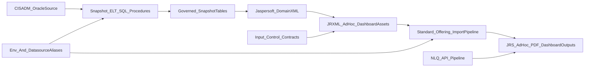

# OriginBA Analytics Platform Mental Model

## Repo overview (high-level)

OriginBA is structured as a governed analytics platform with four coupled layers:

1. Oracle snapshot ELT engineering
2. Jaspersoft semantic/report assets
3. Packaging + promotion automation
4. NLQ/API and Python narrative pipeline

The active reporting source-of-truth is the curated Standard Offering import package:

- `deploy/jaspersoft_standard_offering/Standard_Offering_import.zip`
- `deploy/jaspersoft_standard_offering/standard_offering_package_audit.json`
- `deploy/jaspersoft_standard_offering/standard_offering_verification.json`

The package is intentionally curated as a separate tree under:

- `/organizations/organization_1/organizations/Origin_DEV/SmartCity/Report/Standard_Offering`

and does not mutate the original `Workstreams` tree.

Most important directories:

- Snapshots: `sql/performance/snapshots/`
- Snapshot architecture docs: `sql/performance/snapshots/docs/`
- Jaspersoft authored reports: `reports/`
- Importable Domains: `domains/exports/manual_imports/`
- Built package resources: `deploy/jaspersoft_standard_offering/_build/resources/`
- Input-control contracts: `server/input_controls/`
- Jaspersoft packaging/promotion scripts: `scripts/jaspersoft/`
- API/NLQ: `api/`, `pipeline/`

---

## Data architecture

### Snapshot strategy

The primary data architecture is snapshot-first over Oracle `CISADM` source systems. Active operational truth is documented in:

- `sql/performance/snapshots/deployment_steps/00_active_snapshot_deployment_manifest.md`
- `sql/performance/snapshots/docs/workstream_snapshot_catalog.md`

Current active operational snapshot set (7 in manifest):

- `FT_RPT_CURR` (12 months rolling)
- `BSEG_BILLED_USAGE_RPT_CURR` (12 months rolling)
- `BSEG_SQ_USAGE_RPT_CURR` (12 months rolling)
- `D1_MSRMT_RPT_CURR` (12 months rolling)
- `FT_GL_DISTRIBUTION_RPT_CURR` (6 months rolling)
- `D1_USAGE_RPT_CURR` (12 months rolling)
- `D1_USAGE_SCALAR_DTL_RPT_CURR` (12 months rolling)

Also governed in the snapshot catalog and docs (some not in the active 7 wrapper): `ACCT_DEBT_RPT_CURR`, `COLL_PROC_RPT_CURR`, `PAY_TNDR_CASH_RPT_CURR`.

### Refresh logic and ETL/ELT pattern

Observed common pattern across snapshot procedures:

- Oracle-side ELT in PL/SQL and SQL scripts
- baseline full-history procedure for initial load (`01a`/`02a` variants)
- operational rolling-window maintenance procedure (`01`/`02` variants)
- pre-aggregation of child detail before joining to preserve grain
- targeted `DELETE` + `INSERT`/`APPEND` + controlled `COMMIT`
- optional post-load `MERGE` overlays for descriptive enrichment

Orchestration:

- Operational runner: `sql/performance/snapshots/deployment_steps/06_run_all_operational_refreshes.sql`
- Job scheduler wrapper: `sql/performance/snapshots/deployment_steps/07_schedule_all_active_snapshots.sql`
- Staggered schedule utility: `sql/performance/snapshots/apply_6hour_staggered_schedule_1am_base.sql`

### Source systems and transformations

Primary source families are Oracle C2M/CIS tables:

- Finance/billing: `CI_FT`, `CI_FT_GL`, `CI_BSEG`, `CI_BILL`
- Meter/usage: `D1_USAGE`, `D1_USAGE_SCALAR_DTL`, `D1_MSRMT`, `C1_USAGE`
- Debt/collections: `CI_COLL_PROC`, `CI_COLL_EVT`, arrears-filtered `CI_FT`
- Payments/cashiering: `CI_PAY_TNDR`, `CI_PAY_EVENT`, `CI_TNDR_CTL`, `CI_DEP_CTL`

Common transformation patterns:

- row-grain preservation first, enrichment second
- effective-dated joins for time-correct context
- type-gated joins (for FT family-specific child detail)
- deterministic ranking/window logic when selecting one descriptive row

---

## Reporting architecture (Jaspersoft specifics)

### Artifact model

Jaspersoft assets are layered:

- JRXML reports in `reports/`
- Domain XML imports in `domains/exports/manual_imports/`
- Built repository resources in `deploy/jaspersoft_standard_offering/_build/resources/`
- Input controls in `server/input_controls/`

Governance contract enforces Domain-first design (unless explicitly SQL-based): `AGENTS.md`.

### Standard Offering package as reporting endpoint truth

Per package verification:

- `102` curated report/ad hoc/dashboard objects
- `35` unique domain resources
- datasource dependency included (`Origin_DEV_DS`)
- endpoints rewritten under `Standard_Offering`
- no lingering `/public/templates/actual_size.820.jrxml` dependencies

Operationally, this package is the deployable endpoint map for reporting.

### Query and parameter patterns

- Domain-backed reports use `queryString language="domain"` where governed semantic reuse is desired.
- KPI/scorecard style assets (for example `reports/ops_hub_dashboard.jrxml`) use direct SQL with constrained parameters.
- Parameter contracts are mirrored in `server/input_controls/*.json` and `*_rest.json`.

Example KPI parameter contract:

- `CLIENT_ID`
- `START_TS`
- `END_TS`

### Mapping reports to business metrics

The SmartCity KPI pack is centralized in:

- `sql/smartcity_9_workstream_kpis.sql`

and mirrored in:

- `reports/ops_hub_dashboard.jrxml`

Workstream KPI examples:

- billing: `OPEN_BILLS`
- cashiering: `UNRESOLVED_TENDER_CONTROLS`
- meter_ops: `INSTALL_EVENTS`
- customer_ops: `CONTACT_LETTER_DEFECTS`
- new_services: `STALE_PENDING_SA`
- finance: `FT_MISSING_GL_STATUS`
- common: `INACTIVE_LOOKUP_VALUES`
- debt_mgmt: `DEBT_OVER_60`
- field_ops: `SP_WITHOUT_INSTALL_EVENT`

---

## API / deployment setup

### Application/API layer

Primary analytics-facing API is NLQ:

- code: `api/nlq_server.py`
- endpoints:
  - `GET /health`
  - `GET /nlq`
  - `POST /nlq`
- optional auth: `NLQ_API_KEY` via `X-API-Key`

NLQ executes governed retrieval via `pipeline.nlq` and returns narrative + metrics payloads.

### Environment and deployment configuration

Runtime/env template: `.env.example`

Main groups:

- AI model keys: `OPENAI_API_KEY`, `GEMINI_API_KEY`
- Oracle connectivity: `ORACLE_USER`, `ORACLE_PASSWORD`, `ORACLE_DSN`, `ORACLE_CLIENT_LIB_DIR`
- pipeline outputs: `USAGE_CSV_PATH`, `NARRATIVE_JSON_PATH`
- risk/audit toggle: `RISK_DATA_ENABLED`
- API auth: `NLQ_API_KEY`

Jaspersoft deployment and import are script-driven under `deploy/` and `scripts/jaspersoft/` using REST endpoints:

- `rest_v2/import`
- `rest_v2/resources`
- `rest_v2/reports/...pdf`

### Dev, QA, Prod differences

The repository defaults to `Origin_DEV`-scoped resources and `Origin_DEV_DS` references in packaged content.

Environment mapping is expressed in input-control configs and promotion tooling:

- Example file: `server/input_controls/billing_master_input_controls.json`
  - `DEV -> C2M_DEV_DS`
  - `QA -> C2M_QA_DS`
  - `PROD -> C2M_PROD_DS`

Promotion to client orgs/environments is rewrite-based, not separate hand-maintained trees:

- `scripts/jaspersoft/prepare_client_imports.py`
- `scripts/jaspersoft/run_client_import_pipeline.py`

This rewrites org and datasource identifiers and optionally overlays target datasource exports.

---

## Key business logic patterns

### Reusable analytics patterns

- Grain-protection-first: aggregate one-to-many child tables before joining.
- Additive-vs-context separation: trusted additive measures are explicit by grain (`TOTAL_BILL_SQ`, `CUR_AMT`, `GL_AMOUNT`, `TOTAL_DEBT`, `TENDER_AMT`).
- Process-vs-fact separation: process snapshots (`COLL_PROC_RPT_CURR`) are not debt truth (`ACCT_DEBT_RPT_CURR`).
- Type-gated enrichment: FT child overlays only where FT type family applies.
- Canonical bridge rules: usage-to-billing bridge through `D1_USAGE.USG_EXT_ID -> C1_USAGE.USAGE_ID` (`BD-PROC`).

### KPI logic ownership pattern

KPI logic currently exists as:

- canonical SQL pack (`sql/smartcity_9_workstream_kpis.sql`)
- mirrored report SQL (`reports/ops_hub_dashboard.jrxml`)

This is practical for delivery but creates drift risk unless governed by an explicit ownership contract.

---

## Architecture (source -> snapshot -> report -> output)

---

## Gaps / unknowns needing clarification

1. Active production usage subset inside the `102` packaged reports is not explicitly tracked in one operational list (package inventory exists, runtime adoption list is separate).
2. Environment naming in code is DEV/QA/PROD; separate STAGE naming is not evidenced in the current artifacts.
3. Snapshot coverage is strong for billing/finance/meter/debt/payments, but several workstreams remain report/domain-centric without governed snapshots (`common`, `customer_ops`, `field_ops`, `new_services`).
4. KPI canonical-source policy (SQL pack vs JRXML embedded SQL precedence) needs formal governance to avoid silent drift.
