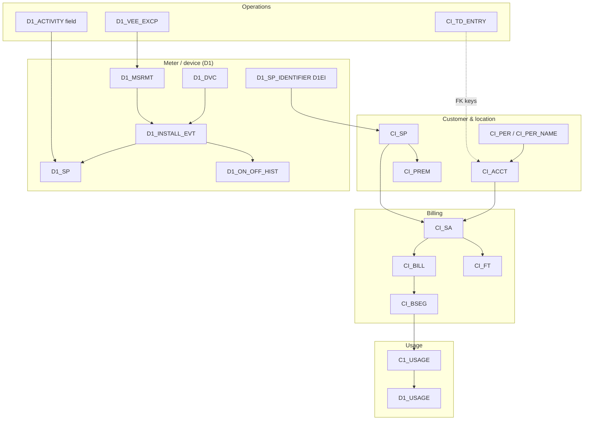

# C2M workstreams — how the pieces connect

Odessa reporting sits on **many linked tables**, not one fact table.  
Each workstream below is a **process** in C2M; gates check that converted data still follows these chains.

---

## The big picture



**Golden rule:** CIS keys are often **10 characters** (`ACCT_ID`, `SP_ID`). D1 keys are often **12 characters** (`D1_SP_ID`). The bridge is usually `D1_SP_IDENTIFIER` (`SP_ID_TYPE_FLG = 'D1EI'`).

---

## 1. Billing

**What it is:** Money and consumption billed to an account for a period.

| Role | Table | Key IDs | Status / dates |
|------|--------|---------|----------------|
| Account | `CI_ACCT` | `ACCT_ID` | `BILL_CYC_CD`, `CUST_CL_CD` |
| Service agreement | `CI_SA` | `SA_ID`, `ACCT_ID` | `SA_STATUS_FLG` (`20` = active), `SA_TYPE_CD` (`W-RES`) |
| Bill header | `CI_BILL` | `BILL_ID`, `ACCT_ID` | `BILL_STAT_FLG` (`C ` = complete), `BILL_CYC_CD`, `BILL_DT` |
| Bill segment | `CI_BSEG` | `BSEG_ID`, `BILL_ID`, `SA_ID` | `BSEG_STAT_FLG` (`50` = frozen) |
| SQ lines | `CI_BSEG_SQ` | `BSEG_ID` + UOM/TOU/SQI | `BILL_SQ`, `SQI_CD`, `UOM_CD` |
| Dollars | `CI_FT` | `FT_ID`, `BILL_ID`, `SA_ID` | `FT_TYPE_FLG`, `FREEZE_SW` |

**Chain to customer:**
```
CI_BSEG → CI_SA → CI_ACCT → CI_ACCT_PER → CI_PER_NAME
         → CI_BILL
         → CI_PREM (via SA.CHAR_PREM_ID or BSEG.PREM_ID)
```

**What breaks reports:** blank `CI_BILL.BILL_CYC_CD`, missing `CI_BSEG_SQ`, broken SA→bill link.

**Gates:** `gates/billing/*`

---

## 2. Financial transactions (FT)

**What it is:** AR ledger lines tied to bills and service agreements (often shown on finance workstream).

**Chain:** `CI_FT` → `CI_SA` → `CI_ACCT` (optional `CI_BILL`, `CI_BSEG`)

**Gates:** `gates/billing/ft_bill_sa_linkage.sql`

---

## 3. To-do / workflow

**What it is:** Work items for staff (billing errors, meter work, VEE review).

| Table | Keys | Notes |
|-------|------|--------|
| `CI_TD_ENTRY` | `TD_ENTRY_ID`, `TD_TYPE_CD` | `ENTRY_STATUS_FLG`: O/W/C |
| `CI_TD_DRLKEY` | `TD_ENTRY_ID`, `KEY_VALUE` | Pivots to `ACCT_ID`, `BSEG_ID`, `D1_SP_ID`, etc. |

**Chain to customer:** todo → FK pivot → `CI_ACCT` / `CI_SP` / `CI_PREM` → name/address

**What breaks reports:** blank `ASSIGNED_TO` (assignee filters drop rows), missing FK pivot rows.

**Gates:** `gates/workflow/*`

---

## 4. Meter operations (install, on/off, reads)

**What it is:** Physical meter at a service point over time.

| Table | Keys | Notes |
|-------|------|--------|
| `D1_INSTALL_EVT` | `INSTALL_EVT_ID`, `DEVICE_CONFIG_ID`, `D1_SP_ID` | `ON` / `OFF` / `REMOVE` |
| `D1_ON_OFF_HIST` | `INSTALL_EVT_ID`, `ONOFF_HIST_FLG` | `D1ON` / `D1OF` — updates while still installed |
| `D1_MSRMT` | `MEASR_COMP_ID`, `MSRMT_DTTM` | Processed reads |
| `D1_MEASR_COMP` | links device config to measurements |

**On vs Off vs Removed (C2M):**
- **On** — in service at SP
- **Off** — still at SP, temporarily out of service (`OFF` + `D1OF`, no removal date)
- **Removed** — left SP (`REMOVE` + removal date)

**Chain to customer:**
```
D1_MSRMT → D1_MEASR_COMP → D1_INSTALL_EVT → D1_SP
  → D1_SP_IDENTIFIER (D1EI) → CI_SP → CI_PREM → CI_SA → CI_ACCT
```

**Gates:** `gates/meter_ops/*`

---

## 5. Devices

**What it is:** Device master (meter serial, model, status) and where it is installed.

| Table | Keys |
|-------|------|
| `D1_DVC` | `D1_DEVICE_ID` |
| `D1_DVC_CFG` | `DEVICE_CONFIG_ID`, effective-dated |
| `DEVICE_SP_RPT_CURR` | snapshot at device grain |

Same **D1EI bridge** as meter ops. Jaspersoft device domains use `CMS_DVC_ACCT` pattern: device → install → D1EI → `CI_SP` → premise.

**Gates:** `gates/devices/*`

---

## 6. Field activity / work orders

**What it is:** Field work (D1FA activities) — installs, investigations, crew visits.

| Table | Keys |
|-------|------|
| `D1_ACTIVITY` | `D1_ACTIVITY_ID`, `BO_STATUS_CD` |
| `D1_ACTIVITY_REL_OBJ` | links activity to `D1_SP_ID` |
| `FIELD_ACTIVITY_RPT_CURR` | governed snapshot |

**Chain:** `D1_ACTIVITY` → SP link → `D1_SP` → (D1EI) → `CI_SP` → `CI_PREM` → customer

**Note:** W1 asset tables exist for equipment overlay; primary field snapshot is `D1_ACTIVITY` (D1FA), not a separate W1 work-order fact in this repo.

**Gates:** `gates/field_ops/*`

---

## 7. VEE (validation exceptions)

**What it is:** Meter read validation failures before billing.

| Table | Keys |
|-------|------|
| `D1_VEE_EXCP` | `VEE_EXCP_ID`, `INIT_MSRMT_DATA_ID` |
| `D1_INIT_MSRMT_DATA` | raw interval read |
| `OPS_EXCEPTION_RPT_CURR` | unified exception snapshot (`EXCP_SOURCE='VEE'`) |

**Chain:** VEE → IMD → measuring component → install → SP; optional todo via `CI_TD_DRLKEY`

**Gates:** `gates/vee/*`

---

## 8. Usage

**What it is:** Measured consumption transactions between read and bill.

| Table | Keys |
|-------|------|
| `D1_USAGE` | `D1_USAGE_ID`, `USG_EXT_ID` |
| `C1_USAGE` | `USAGE_ID`, `BSEG_ID`, `SA_ID`, `BO_STATUS_CD` (`BD-PROC`) |
| `D1_USAGE_SCALAR_DTL` | quantities |

**Chain to billing:**
```
CI_BSEG → C1_USAGE (USAGE_ID = D1_USAGE.USG_EXT_ID) → D1_USAGE → scalars
       → CI_SA → CI_ACCT
```

**Gates:** `gates/usage/*`

---

## How to use this with gates

| Step | Command |
|------|---------|
| Understand one process | Read section above + `MANIFEST.md` gate table |
| Profile the DB | `python3 scripts/local/run_conversion_validation.py --client odessa_dev --discovery-only` |
| Run all gates | `python3 scripts/local/run_conversion_validation.py --client odessa_dev` |
| One workstream | `python3 scripts/local/run_conversion_validation.py --client odessa_dev --workstream billing` |

Synthetic proof data: `sql/odessa_dev/test_data/` (when conversion gaps are fixed or need report smoke tests).
